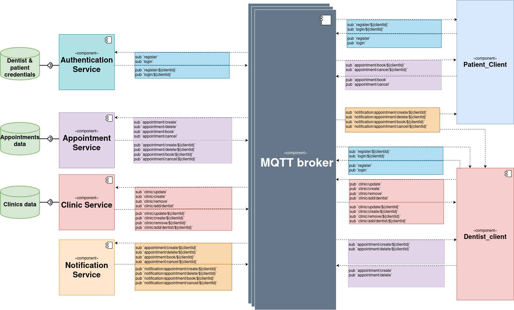
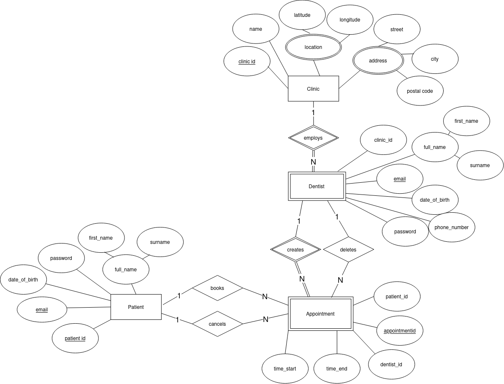
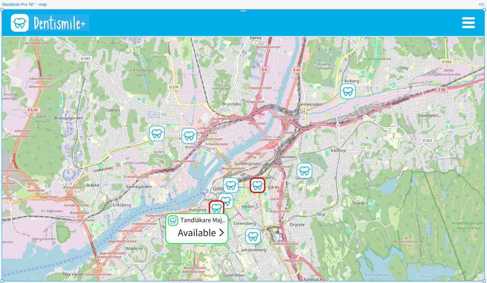
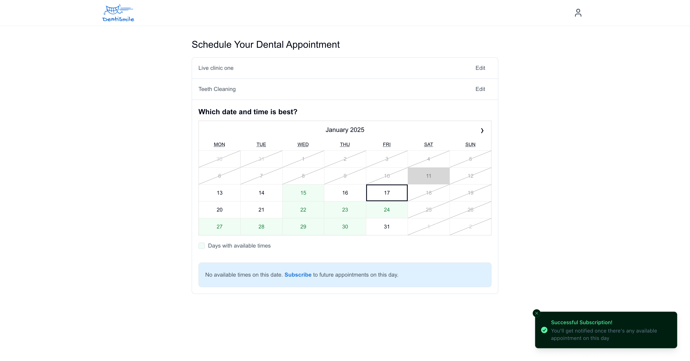
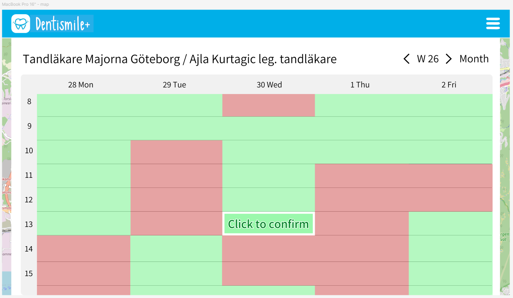
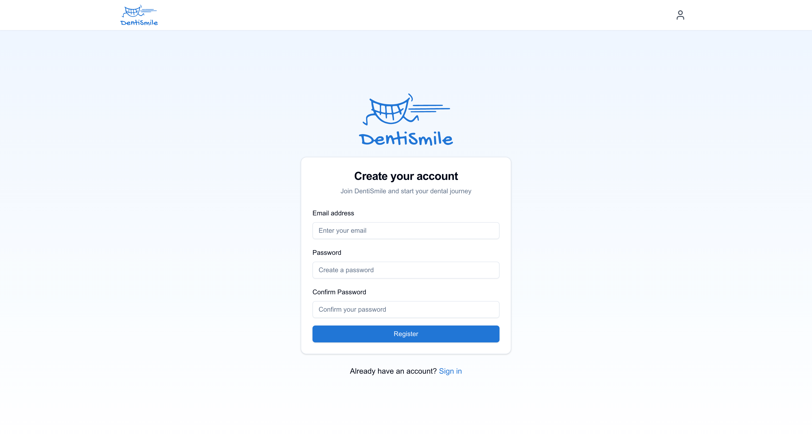

# DentiSmile+ (Group-7)

### Description

DentiSmile+ is a distributed appointment booking system designed specifically for residents of Gothenburg, Sweden, to easily find and book dentist appointments. The system provides a responsive web interface for users to view available appointment slots on a map, book or cancel appointments, and receive real-time notifications. It also includes tools for dentists to manage their schedules.

The DentiSmile+ system leverages a distributed microservices architecture combining a client-server with microservice as well as MQTT messaging to enable real-time updates.

## System Architecture



## ER Diagram



## Figma Prototype

<table>
  <tr>
    <td></td>
    <td></td>
  </tr>
  <tr>
    <td></td>
    <td></td>
  </tr>
</table>

## Requirements

- Node.js (v20+)
- Vue CLI
- MongoDB
- RabbitMQ broker

`Add other tech stack here`

## Usage

- As a user: view available clinics and slots for a clinic on a map of Gothenburg and book/cancel dentist appointments.
- As a dentist: manage their own availability through the dentist interface.
- Real-time notifications are enabled for booking status updates through MQTT.

## Docker Setup

### Quick Start

```bash
# Using default setup
docker compose up -d

# Using development setup
docker compose -f docker-compose.dev.yml up -d
```

### Available Docker Configurations

1. **Development Setup**:
   - Enhanced for development with hot-reloading
   - Uses files: `docker-compose.dev.yml` and `.dev` Dockerfiles in service directories

## Issues / Support

In order to follow a unified process, we have agreed as a team to follow the general rules in an [Issue template](Issue-template.md) that we created.

If you encounter any issues, please submit them through the [issue tracker](https://git.chalmers.se/courses/dit355/2024/student_teams/dit356_2024_07/group-7/-/issues).

## Roadmap

- **MS1**: Implement 20% of core functionality (Microservices,client, MQTT, documentation)
- **MS2**: Implement remaining core features and improve client UI
- **MS3**: Complete system design, integrate additional requirements shared in december

- **Final presentation**: System testing, cleanup, and preparation for demonstration

## Contributing

We welcome contributions! Please refer to our [CONTRIBUTING.md](CONTRIBUTING.md) for guidelines on how to contribute, report issues, and submit pull requests.

## Authors and Acknowledgments

- Team Members: Maksym Matsuhyria, Ahmet Yavuz Kalkan, Yaroslav Ursul, Andre Ibrahim, Mahmoud Khalafallah
- Special thanks to the course instructors and TA’s for guidance on distributed systems and project management.

## License

This project is licensed under the MIT License - see the [LICENSE](LICENSE) file for details.

## Project Status

Active - Currently in development with milestone-based releases.
